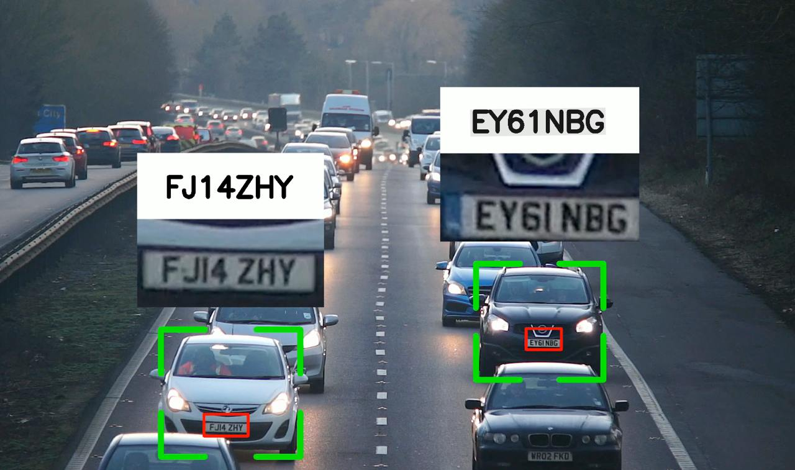

# License Plate Recognition Project

This project is designed to recognize and process license plates from video footage. It uses various machine learning models and utilities to detect vehicles, read license plates, and visualize the results.

How it works:

- Detect cars, motorcycles, buses, and trucks, and assign each a unique ID with YOLO predefined model trained on COCO dataset.
- Assign each vehicle with an ID using online and real-time tracking from [SORT](https://github.com/abewley/sort).
- Detect number plates with a custom-trained YOLO model.
- Assign number plates to their corresponding vehicles based on the bounding boxes of both.
- Use EasyOCR to recognize the text from the plates, specifically using German number formatting (7 digits with CCNNCCC, where C is a character and N is a number).
- Save data in a CSV file.
- Enrich data by filling in missing frames.
- Visualize results by selecting the most confident plate number for each vehicle.

## Project Structure

- `src/`: Contains the main source code for the project.
  - `utils/`: Utility functions and modules.
    - `license_plate_utils.py`: Functions for reading and formatting license plates.
    - `file_utils.py`: Functions for file operations like validating paths and writing CSV files.
    - `detection_utils.py`: Functions for detecting vehicles.
    - `add_missing_data.py`: Functions for adding missing data.
    - `visualize.py`: Functions for visualizing results.
  - `main.py`: Main script to process the video and generate results.
- `data/videos/`: Directory for input videos.
  - `sample_video_1.mp4` to `sample_video_6.mp4`

## Installation

1. Clone the repository:

   ```bash
   git clone https://github.com/azizbeksiddikov/plate-recognition.git .
   ```

2. Install the required packages:
   ```bash
   pip install -r requirements.txt
   ```
3. Get videos and src/model/license_plate_detector.pt at
   '''
   https://drive.google.com/drive/folders/1g6sprTklLqqZDD8jafifs3CLzXEgiRNf?usp=drive_link
   '''
4. Install sort from [SORT](https://github.com/abewley/sort)

## Usage and Configuration

1. Place your input video in the `data/videos/` directory.
2. Modify the paths in `src/main.py` to point to your input video and model files.
3. Adjust the detection and processing parameters as needed.
4. Run the main script:
   ```bash
   python src/main.py
   ```

## Output

- The processed video will be saved in the `data/videos/` directory.
- The results will be written to CSV files in the `data/` directory.

## Example from Video


